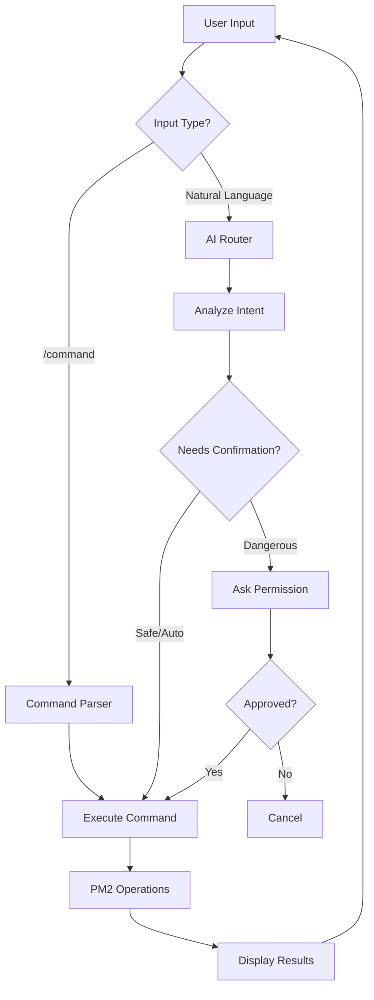

# PM2-X Architecture

## Overview

PM2-X is built with a modular architecture that separates concerns between AI processing, command routing, and PM2 operations. The system is designed to be extensible and maintainable while providing a seamless user experience.

## Intelligent Command Processing Workflow

PM2-X uses an advanced AI-driven workflow to process natural language commands in any language:



## Key Components

### 1. AI Router (`src/services/ai-input-router/`)

Routes natural language commands to appropriate handlers using LLM analysis.

**Key Files:**

- `AIInputRouter.ts` - Main routing logic
- `ActionDetector.ts` - Detects user intent and required actions
- `types.ts` - Type definitions for AI routing

### 2. Command Parser (`src/shell/CommandParser.ts`)

Handles traditional slash commands with fast, deterministic parsing.

### 3. AI Providers (`src/services/ai-providers/`)

Integrations with external AI services.

**Supported Providers:**

- `OpenAIService.ts` - OpenAI GPT integration
- `GeminiService.ts` - Google Gemini integration
- `AIProviderFactory.ts` - Provider factory and management

### 4. Shell System (`src/shell/`)

Interactive shell interface and state management.

**Components:**

- `Shell.ts` - Main shell orchestrator
- `input/` - Input handling and validation
- `routing/` - Command routing logic
- `state/` - State management
- `ui/` - User interface components

### 5. Service Layer (`src/services/`)

Core business logic and PM2 integrations.

**Key Services:**

- `PM2Manager.ts` - PM2 operations wrapper
- `ExecutionManager.ts` - Command execution orchestration
- `ConversationManager.ts` - Context and conversation state
- `ErrorAnalysisService.ts` - AI-powered error analysis

### 6. Commands (`src/commands/`)

Individual command implementations following the Command Pattern.

**Command Categories:**

- Process management (start, stop, restart)
- Monitoring (status, metrics, logs)
- AI-powered (diagnose, optimize, doctor)
- Utility (help, clear, exit)

## Dependency Injection

PM2-X uses `tsyringe` for dependency injection, providing:

- **Loose coupling** between components
- **Easy testing** with mock implementations
- **Extensibility** for new features
- **Clear interfaces** between layers

**Container setup:** `src/container.ts`

## Key Features of the AI Workflow

### 1. Language Agnostic

Understands commands in any language supported by the LLM:

- English: "restart my app"
- Spanish: "reinicia mi aplicación"
- French: "redémarre mon application"
- Japanese: "アプリを再起動して"

### 2. Context Aware

Maintains conversation context:

- Remembers previous commands
- Uses conversation history for disambiguation
- Maintains process-specific context

### 3. Safety First

Dangerous operations always require confirmation:

- Destructive actions (delete, kill)
- Batch operations (restart all)
- Configuration changes
- Even in AUTO mode, critical operations need approval

### 4. Smart Defaults

Uses conversation history to fill missing parameters:

- "restart it" after discussing a specific process
- "check the logs" refers to last mentioned process
- "try again" repeats last failed command

### 5. Flexible Interaction

Supports multiple interaction patterns:

- Numbered selections from lists
- Natural language responses
- Traditional slash commands
- Mixed command styles within same session

## Data Flow

### 1. User Input Processing

```text
User Input → Shell → CommandParser/AIRouter → Intent Analysis
```

### 2. Command Execution

```text
Intent → ExecutionManager → PM2Manager → PM2 Operations → Results
```

### 3. AI Analysis

```text
Command → AIProvider → LLM Analysis → Structured Response → User
```

### 4. Error Handling

```text
Error → ErrorAnalysisService → AI Diagnosis → Actionable Suggestions
```

## Configuration Management

### Thread-Safe Configuration

- File locking prevents corruption during concurrent access
- Atomic writes ensure consistency
- Auto-recovery rebuilds corrupted configs

### Configuration Structure

```typescript
interface PM2XConfig {
  provider: 'openai' | 'gemini';
  userPreferences: UserPreferences;
  openai?: OpenAIConfig;
  gemini?: GeminiConfig;
}
```

## Extension Points

### Adding New Commands

1. Create command class in `src/commands/`
2. Implement `ICommand` interface
3. Register in `src/container.ts`
4. Add to command registry

### Adding New AI Providers

1. Implement `IAIProvider` interface
2. Add to `AIProviderFactory`
3. Update configuration types
4. Add provider-specific settings

### Adding New Shell Components

1. Create component in appropriate `src/shell/` subdirectory
2. Define interface contract
3. Register with dependency injection
4. Wire into shell orchestration

## Performance Considerations

### AI Response Optimization

- Streaming responses for real-time feedback
- Caching for repeated queries
- Provider-specific optimizations
- Configurable timeouts

### Memory Management

- Conversation context pruning
- Command history limits
- Resource cleanup on exit
- Efficient process monitoring

### Error Resilience

- Graceful degradation without AI
- Fallback to basic commands
- Network failure handling
- Process monitoring reliability
